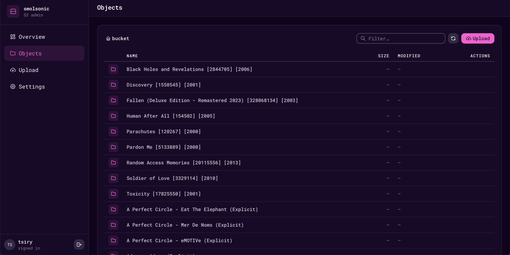

# smolsonic
[](https://github.com/tsirysndr/smolsonic/actions/workflows/release.yml)
[](https://crates.io/crates/smolsonic)
[](LICENSE)

A tiny, self-contained music + video server written in Rust. Speaks both the
[Subsonic API](http://www.subsonic.org/pages/api.jsp) and a Jellyfin-compatible
API on a side port, so you can use either ecosystem of clients. Point it at a
folder of music (and optionally a folder of videos), give it a username and a
password in a TOML file, and any [Subsonic client](https://www.navidrome.org/apps/)
or Jellyfin-compatible client (Finamp, Findroid, Streamyfin, Amcfy, …) can
browse and stream your library.

```
                     _                  _
 ___ _ __ ___   ___ | |___  ___  _ __  (_) ___
/ __| '_ ` _ \ / _ \| / __|/ _ \| '_ \ | |/ __|
\__ \ | | | | | (_) | \__ \ (_) | | | || | (__
|___/_| |_| |_|\___/|_|___/\___/|_| |_||_|\___|
                a tiny Subsonic server in Rust
```

## Table of contents

- [Features](#features)
- [Install](#install)
- [Quick start](#quick-start)
- [Configuration](#configuration)
  - [S3-compatible API](#s3-compatible-api)
  - [S3 admin web UI](#s3-admin-web-ui)
  - [Jellyfin-compatible API](#jellyfin-compatible-api)
  - [UPnP / DLNA media server](#upnp--dlna-media-server)
  - [Zeroconf / mDNS](#zeroconf--mdns)
  - [Search backends](#search-backends)
  - [ListenBrainz scrobbling](#listenbrainz-scrobbling)
  - [Last.fm + MusicBrainz plugins](#lastfm--musicbrainz-plugins)
- [CLI](#cli)
- [Supported endpoints](#supported-endpoints)
- [Tested clients](#tested-clients)
- [How auth works](#how-auth-works)
- [Development](#development)
- [License](#license)

## Features

- One binary, one TOML file, one SQLite database. No external services required.
- Built on **actix-web 4** with **sqlx** (SQLite) for storage.
- Library scanner powered by **lofty** — extracts ID3/Vorbis/MP4/etc. tags and
  embedded cover art from `mp3`, `flac`, `ogg`, `opus`, `m4a`, `wav`, and more.
- Falls back to `cover.jpg` / `folder.jpg` / `front.jpg` next to the audio file
  if there's no embedded picture.
- Stable IDs (`ar-…` / `al-…` / `so-…`) derived from tag content, so re-scans
  are idempotent and clients don't lose their bookmarks.
- HTTP `Range` support for proper seeking.
- Subsonic **token auth** (`t = md5(password + salt)`) and plaintext (`p=…`
  or `p=enc:<hex>`) both supported.
- CORS is permissive — works directly from web clients.
- Optional **S3-compatible API** for uploading and deleting files in your
  library with any S3 client (`aws`, `mc`, `boto3`, `rclone`, …).
- **Embedded S3 admin web UI** at `/admin/` of the S3 server — browse,
  upload, and delete objects from your browser, no extra service needed.
- **Extensive Jellyfin-compatible sidecar API** on its own port — Favorites,
  UserData, InstantMix, Lyrics, Similar, RemoteImage, Filter, Genre, Year,
  Person/Studio, Items/Counts, Suggestions/Resume/Latest rails. Works with
  Finamp, Findroid, Streamyfin, Symfonium, Amcfy Music, and other native
  clients.
- **Optional metadata plugins** — Last.fm and MusicBrainz enable similar
  artists, cover art from Cover Art Archive, and biographies/tags on artist
  and album detail pages. All opt-in via TOML.
- **Optional ListenBrainz scrobbling** — Jellyfin session events and Subsonic
  `/rest/scrobble` submit `playing_now` + `single` listens following the
  Last.fm submission rules.
- **Optional UPnP/DLNA media server** — announces the library over SSDP so
  DLNA renderers and control points (VLC, BubbleUPnP, Kodi, smart TVs, …)
  can browse Artists / Albums / Playlists and stream directly.
- **Optional Typesense search backend** with automatic FTS5 fallback.
- **Optional video library** scanned alongside music — direct-play streaming,
  ffmpeg-based thumbnail generation when no sibling poster exists.
- **Zeroconf / mDNS** announcement so clients on the LAN discover the
  server automatically (Subsonic, S3, and Jellyfin when enabled), plus the
  Jellyfin UDP 7359 client-discovery probe.

## Install

Install script (macOS / Linux, amd64 / aarch64, plus linux armhf):

```sh
curl -fsSL https://raw.githubusercontent.com/tsirysndr/smolsonic/main/install.sh | sh
```

Pin a version or change the install directory with env vars:

```sh
curl -fsSL https://raw.githubusercontent.com/tsirysndr/smolsonic/main/install.sh \
  | SMOLSONIC_VERSION=v0.9.0 SMOLSONIC_INSTALL=$HOME/.local/bin sh
```

Homebrew (macOS / Linux):

```sh
brew install tsirysndr/tap/smolsonic
```

Debian / Ubuntu (`.deb` for `amd64`, `arm64`, `armhf`):

```sh
# From the Gemfury apt repo
echo "deb [trusted=yes] https://apt.fury.io/tsiry/ /" \
  | sudo tee /etc/apt/sources.list.d/smolsonic.list
sudo apt-get update
sudo apt-get install smolsonic

# Or download a .deb directly from the release page
curl -fsSLO https://github.com/tsirysndr/smolsonic/releases/latest/download/smolsonic_0.9.0_amd64.deb
sudo dpkg -i smolsonic_0.9.0_amd64.deb
```

Fedora / RHEL (`.rpm` for `x86_64`):

```sh
# From the Gemfury yum repo
sudo tee /etc/yum.repos.d/smolsonic.repo <<'EOF'
[smolsonic]
name=smolsonic
baseurl=https://yum.fury.io/tsiry/
enabled=1
gpgcheck=0
EOF
sudo dnf install smolsonic

# Or download an .rpm directly from the release page
curl -fsSLO https://github.com/tsirysndr/smolsonic/releases/latest/download/smolsonic-0.9.0-1.x86_64.rpm
sudo rpm -i smolsonic-0.9.0-1.x86_64.rpm
```

The `.deb` / `.rpm` packages drop the binary at `/usr/local/bin/smolsonic`,
an example config at `/usr/share/smolsonic/smolsonic.example.toml`, and a
systemd user unit at `/usr/lib/systemd/user/smolsonic.service`. After
install:

```sh
# Config was seeded for you — edit music_dir, username, password
$EDITOR ~/.config/smolsonic/smolsonic.toml

systemctl --user enable --now smolsonic.service
systemctl --user status smolsonic.service
```

Nix flake:

```sh
# Run without installing
nix run github:tsirysndr/smolsonic -- --config smolsonic.toml

# Install into your profile
nix profile install github:tsirysndr/smolsonic

# Or drop into a dev shell with cargo + deps
nix develop github:tsirysndr/smolsonic
```

Or build from source:

```sh
cargo build --release
```

## Quick start

```sh
# 1. Create a config
cp smolsonic.example.toml smolsonic.toml
$EDITOR smolsonic.toml      # set music_dir, username, password

# 2. Run
smolsonic --config smolsonic.toml
```

On first launch smolsonic scans `music_dir`, creates the SQLite database, and
starts the HTTP server. Point any Subsonic client at
`http://<host>:<port>/rest/…` using the credentials from your TOML file.

## Configuration

`smolsonic.toml` (all keys shown):

```toml
music_dir     = "/path/to/your/music"   # required
username      = "admin"                  # required
password      = "changeme"               # required

# Optional — defaults shown
port          = 4533
host          = "0.0.0.0"
database_path = "smolsonic.db"
covers_dir    = "covers"

# Optional S3-compatible upload API. Bucket name is fixed to "music",
# region is "us-east-1".
[s3]
enabled    = true
host       = "0.0.0.0"
port       = 9000
access_key = "smolsonic"
secret_key = "changeme-please"

# Optional Jellyfin-compatible API on a side port. Omit the block to disable.
[jellyfin]
port        = 8096           # required — presence + port enables the sidecar
host        = "0.0.0.0"      # optional
server_name = "smolsonic"    # optional — name clients display

# Optional video library — scanned independently from music_dir.
[video]
video_dir          = "/path/to/your/videos"
scan_interval_secs = 300        # optional, default 300 (0 disables)
library_name       = "Movies"   # optional, shown to Jellyfin clients

# Optional UPnP/DLNA media server. Omit the block to disable.
[upnp]
enabled       = true         # optional, default true when the section exists
host          = "0.0.0.0"    # optional
port          = 8200         # optional
friendly_name = "smolsonic"  # optional — name renderers display

# Optional Zeroconf/mDNS service broadcast. Enabled by default.
[mdns]
enabled       = true
instance_name = "smolsonic"
```

| Key              | Purpose                                                     |
| ---------------- | ----------------------------------------------------------- |
| `music_dir`      | Root of your library. Walked recursively.                   |
| `username`       | The single Subsonic user.                                   |
| `password`       | Cleartext on disk; used for both token and plaintext auth.  |
| `port`           | TCP port to bind.                                           |
| `host`           | Interface to bind (use `127.0.0.1` to keep it local).       |
| `database_path`  | Path to the SQLite file. Created if missing.                |
| `covers_dir`     | Where extracted album art is cached.                        |
| `[s3]`           | Optional S3 server section (see below).                     |
| `[jellyfin]`     | Optional Jellyfin-compatible API on its own port.           |
| `[video]`        | Optional video library, surfaced through the Jellyfin API.  |
| `[upnp]`         | Optional UPnP/DLNA media server (see below).                |
| `[mdns]`         | Optional Zeroconf/mDNS broadcast (see below).               |
| `[typesense]`    | Optional Typesense search backend (falls back to FTS5).     |
| `[lastfm]`       | Optional Last.fm plugin — similar artists + bios + tags.    |
| `[musicbrainz]`  | Optional MusicBrainz plugin — cover art + linked artists.   |
| `[listenbrainz]` | Optional ListenBrainz scrobble target.                      |

### S3-compatible API

`smolsonic` ships an embedded S3 gateway whose objects map 1:1 to files under
`music_dir`. Uploads land on disk, then the built-in filesystem watcher picks
them up and rescans them into the library automatically. Deletes work the same
way — removing an object removes it from the library on the next debounce.

The bucket is always `music` and the region is always `us-east-1` — they're
not exposed in the config. The endpoint URL is whatever you bind in
`[s3]`. Authentication uses AWS Signature V4 with the `access_key` and
`secret_key` you set in the TOML file.

Example with the MinIO client:

```sh
mc alias set smol http://localhost:9000 smolsonic changeme-please --api S3v4
mc cp track.flac smol/music/Artist/Album/track.flac
mc ls smol/music/
mc rm smol/music/Artist/Album/track.flac
```

Or with `aws-cli`:

```sh
aws --endpoint-url http://localhost:9000 \
    s3 cp track.flac s3://music/Artist/Album/track.flac
```

| Key          | Purpose                                                       |
| ------------ | ------------------------------------------------------------- |
| `enabled`    | Toggle the S3 server. Default `true` when the section exists. |
| `host`       | Interface to bind for S3. Default `0.0.0.0`.                  |
| `port`       | TCP port for the S3 server. Default `9000`.                   |
| `access_key` | Required. The S3 access key clients must present.             |
| `secret_key` | Required. The S3 secret key used to verify Sig V4 signatures. |

Supported operations: `ListBuckets`, `ListObjectsV2` (with `prefix` and
`delimiter`), `HeadBucket`, `HeadObject`, `GetObject`, `PutObject`,
`DeleteObject`. Streaming (`STREAMING-AWS4-HMAC-SHA256-PAYLOAD`), unsigned,
and SHA-256-signed payloads are all accepted on uploads.

### S3 admin web UI

`smolsonic` also ships a React SPA embedded directly in the binary and
served at `/admin/` of the S3 server. Sign in with the `access_key` /
`secret_key` from your TOML config to browse the `music` bucket, upload
new files, and delete existing ones — all from the browser. Requests are
signed with AWS Signature V4 on the client side and hit the same S3
endpoints documented above.



Open it at:

```
http://<s3-host>:<s3-port>/admin/
```

### Jellyfin-compatible API

`smolsonic` ships an optional second HTTP server that speaks enough of the
[Jellyfin API](https://api.jellyfin.org/) to look like a real Jellyfin server
to native clients. It runs on a separate port from the Subsonic API and is
disabled unless `[jellyfin]` is set in the TOML.

```toml
[jellyfin]
port = 8096
```

What it implements (grouped by [Jellyfin OpenAPI](https://api.jellyfin.org/) tag):

- **System / auth** — `/System/Info(/Public)` spoofs `Version: 10.11.x` so
  modern clients accept it; `/Users/AuthenticateByName` bridges to the TOML
  `username`/`password` and issues an opaque token persisted in SQLite.
  Tokens accepted via `X-Emby-Token`, `Authorization: MediaBrowser Token=…`,
  and `?api_key=` for streaming URLs. `/Users/Public`, `/Users/{id}`,
  `/Users/{id}/Views`, `/UserViews`, `/Library/MediaFolders`,
  `/Library/VirtualFolders`.
- **Items browsing** — `/Items`, `/Users/{id}/Items` handle `parentId`,
  `includeItemTypes`, `mediaTypes`, `searchTerm`, `albumArtistIds`/`artistIds`,
  `ids`, and pagination. Accept both camelCase and PascalCase parameter
  names, and repeated keys (`?includeItemTypes=Folder&includeItemTypes=Movie`).
  Also `/Items/{id}` single-item lookup, `/Items/{id}/File`,
  `/Items/{id}/PlaybackInfo`, `/Items/Latest`, `/Items/Prefixes`,
  `/Items/Filters`, `/Items/Filters2`, `/Items/Counts`.
- **Home rails** — `/Items/{Suggestions,Resume,Latest}`,
  `/UserItems/{Resume,Latest}`, `/Users/{id}/Items/{Resume,Latest,Suggestions}`,
  `/Users/{id}/Views/{view}/Latest`. Resume reads back items with a saved
  playback position; Suggestions returns random albums (or songs when the
  client asks for `?IncludeItemTypes=Audio`).
- **Artists / Genres / Years / Persons / Studios** —
  `/Artists(/AlbumArtists)`, `/Artists/{name}`, `/Artists/Prefixes`,
  `/Genres(/{name})`, `/MusicGenres(/{name})`, `/Years(/{year})`,
  `/Persons(/{name})`, `/Studios(/{name})`. `parentId=<genre|year guid>`
  drills down to the matching songs or albums.
- **Playlists** — `/Playlists` list/create, `/Playlists/{id}` get/update/
  delete, `/Playlists/{id}/Items` list/add/remove/reorder via
  `PlaylistItemId`.
- **UserData / Favorites / PlayedItems / Rating** —
  `GET`/`POST /UserItems/{id}/UserData`, `POST`/`DELETE /UserFavoriteItems/{id}`,
  `POST`/`DELETE /UserPlayedItems/{id}`, `POST`/`DELETE /UserItems/{id}/Rating`,
  plus the legacy `/Users/{uid}/…` variants that older clients still call.
- **InstantMix** — `/Albums/{id}/InstantMix`, `/Artists/{id}/InstantMix`,
  `/Songs/{id}/InstantMix`, `/Playlists/{id}/InstantMix`,
  `/MusicGenres/{name}/InstantMix`, `/Items/{id}/InstantMix`. Three-tier
  fallback (same artist → same genre → random library-wide) so the mix stays
  populated on small libraries.
- **Similar** — `/Albums/{id}/Similar`, `/Artists/{id}/Similar`,
  `/Movies/{id}/Similar`, `/Trailers/{id}/Similar`, `/Shows/{id}/Similar`,
  `/Items/{id}/Similar`. Powered by the Last.fm + MusicBrainz plugins when
  enabled; empty when neither is configured.
- **Lyrics** — `GET`/`POST`/`DELETE /Audio/{id}/Lyrics` reads and writes
  a `song.lrc` sidecar next to the audio file (case-insensitive). Recognises
  standard LRC metadata (`ar/al/ti/au/length/by/offset/re/ve`), timestamped
  lines, stacked timestamps, and plain-text fallback (`IsSynced=false`).
- **RemoteImage** — `/Items/{id}/RemoteImages`, `/RemoteImages/Providers`,
  `/RemoteImages/Download`. Backed by Last.fm `album.getInfo` and the
  MusicBrainz Cover Art Archive. Downloaded bytes land in `covers_dir` and
  update `albums.cover_art` so the existing image serving picks them up.
- **Streaming** — `/Audio/{id}/{stream,stream.{ext},universal}` and
  `/Videos/{id}/{stream,stream.{ext}}`, all Range-aware, direct-play.
- **Search** — `/Search/Hints` and `/Items?searchTerm=…`, backed by FTS5
  or Typesense (see [Search backends](#search-backends)).
- **Sessions / scrobble** — `/Sessions/Playing/{,Progress,Stopped}`
  submit ListenBrainz `playing_now` and (on stop) a full listen when the
  track qualifies. See [ListenBrainz scrobbling](#listenbrainz-scrobbling).
- **Scheduled tasks** — `/ScheduledTasks/Running/{id}` and `/Library/Refresh`
  kick off a background music + video rescan and return 204 immediately.
- **Compatibility stubs** — `/Shows/NextUp`, `/Shows/Upcoming`,
  `/Items/{id}/Ancestors`, `/Items/{id}/SpecialFeatures`,
  `/Users/{uid}/Items/{id}/Intros`, `/DisplayPreferences/{id}` return
  empty results so clients that probe them stop retrying.

Item IDs are deterministic 32-char SHA-256-prefixed UUIDs (dashed). The
mapping from these GUIDs back to your native `ar-…`/`al-…`/`so-…`/`vi-…`
IDs is stored in `jf_guids` so reverse lookups survive restarts.

#### Service discovery

Two discovery mechanisms run concurrently when the sidecar is enabled:

- `_jellyfin._tcp.local.` mDNS broadcast with a `ID=` TXT record matching
  the server's stable GUID.
- A UDP listener on **port 7359** that replies with
  `{"Address":"http://<lan-ip>:<port>","Id":"…","Name":"…"}` to the literal
  Jellyfin client-discovery probe `"Who is JellyfinServer?"`.

#### Tested clients

| Client            | Type          | Status                                                          |
| ----------------- | ------------- | --------------------------------------------------------------- |
| Finamp            | Android/iOS   | Native music client — full browse + play + scrobble.            |
| Amcfy Music       | Android       | Full browse + play. Triggers library scans on refresh.          |
| Symfonium         | Android       | Music + video, paid; works against the Jellyfin API.            |
| Findroid          | Android       | Video-only by design (filters out music libraries client-side). |
| Streamyfin        | Android       | Movies + audio; works.                                          |
| Official Android  | Android       | Does NOT work: it's a WebView wrapping the Jellyfin web UI,     |
|                   |               | which smolsonic doesn't ship. Use one of the native clients.    |

For music, use **Finamp** (or Amcfy / Symfonium). For video, use
**Findroid** (or Streamyfin).

#### Video library

When `[video]` is configured, smolsonic walks `video_dir` for `.mkv`, `.mp4`,
`.webm`, `.mov`, `.avi`, `.m4v` and exposes them as Jellyfin movies. Title is
the cleaned filename stem. If `ffprobe` is on `PATH` it's used to extract
duration / bitrate / width / height; otherwise those fields default to 0.

Posters resolve in this order:

1. Sibling file with the same stem: `movie.{jpg,png,webp}`
2. `poster.{ext}` / `folder.{ext}` / `cover.{ext}` in the same directory
3. If neither exists and `ffmpeg` is on `PATH`, smolsonic auto-extracts a
   frame at ~10% into the video and caches it under `covers/{video_id}.jpg`.

Playback is direct-play only — clients must support the container natively.

### UPnP / DLNA media server

Add a `[upnp]` block and smolsonic shows up as a **UPnP AV MediaServer:1**
(DMS-1.50) on your LAN — no client configuration at all. Works with DLNA
renderers and control points like VLC (Local Network → Universal Plug'n'Play),
BubbleUPnP, Kodi, mconnect, and most smart TVs and network speakers.

```toml
[upnp]
enabled       = true         # optional, default true when the section exists
host          = "0.0.0.0"    # optional
port          = 8200         # optional
friendly_name = "smolsonic"  # optional — name renderers display
```

| Key             | Purpose                                                        |
| --------------- | -------------------------------------------------------------- |
| `enabled`       | Toggle the UPnP server. Default `true` when the section exists. |
| `host`          | Interface to bind for the UPnP HTTP endpoints. Default `0.0.0.0`. |
| `port`          | TCP port for description/control/streaming. Default `8200`.    |
| `friendly_name` | Device name shown by renderers. Default `smolsonic`.           |

How it works:

- **SSDP discovery** — listens for `M-SEARCH` probes on UDP 1900 (bound with
  `SO_REUSEADDR`/`SO_REUSEPORT`, so it coexists with other UPnP daemons on
  the same host) and multicasts `NOTIFY ssdp:alive` to `239.255.255.250:1900`
  on startup and every 10 minutes, per interface.
- **ContentDirectory** — SOAP `Browse` over the existing SQLite library:
  `root → Artists / Albums / Playlists`, with track metadata (title, artist,
  album, track number, duration, bitrate) and album art URIs in the DIDL-Lite
  results. Paging via `StartingIndex`/`RequestedCount` is honoured.
- **Streaming** — direct-play from the same port, Range-aware, with the
  `contentFeatures.dlna.org` / `transferMode.dlna.org` headers renderers
  expect. Stream URLs end in the real file extension (`…/stream/so-….flac`)
  because some renderers refuse URLs without one.
- The device UUID is persisted in SQLite (`upnp_meta`), so control points
  that key their server list on the UDN keep recognizing the server across
  restarts.

> **Note:** DLNA has no authentication concept, so streams on the UPnP port
> are unauthenticated by design. Only enable `[upnp]` on trusted networks,
> or bind `host` to a specific interface.

### Zeroconf / mDNS

`smolsonic` announces itself on the local network so clients can discover the
server without hard-coding an IP. Three service types are advertised:

- `_subsonic._tcp.local.` — the Subsonic HTTP server, on `port`.
- `_s3._tcp.local.` — the S3 gateway, on `[s3] port`. Only broadcast when
  `[s3] enabled = true`.
- `_jellyfin._tcp.local.` — the Jellyfin sidecar, on `[jellyfin] port`. Only
  broadcast when `[jellyfin]` is configured. The TXT record includes the
  server's stable Jellyfin `Id`.

Only real LAN IPv4 addresses are broadcast. Loopback, link-local,
the Docker default bridge (`172.17.0.0/16`), and virtual interfaces
(`docker*`, `br-*`, `veth*`, `vboxnet*`, `vmnet*`, `virbr*`, `tun*`, `tap*`,
`utun*`, `wg*`, `tailscale*`, `awdl*`, `bridge*`, …) are filtered out.

| Key             | Purpose                                              |
| --------------- | ---------------------------------------------------- |
| `enabled`       | Toggle mDNS broadcast. Default `true`.               |
| `instance_name` | Service instance name. Default `smolsonic`.          |

Discover with `dns-sd` (macOS) or `avahi-browse` (Linux):

```sh
dns-sd -B _subsonic._tcp
avahi-browse -r _subsonic._tcp
```

### Search backends

Free-text search (`/rest/search3`, `/rest/search2`, Jellyfin `?searchTerm=`)
defaults to SQLite's built-in FTS5 index. Add a `[typesense]` block to swap
in [Typesense](https://typesense.org/) for typo-tolerant search and better
ranking without changing any client:

```toml
[typesense]
url = "http://localhost:8108"
api_key = "changeme"
# collection_prefix = "smolsonic"   # optional
```

Boot a local Typesense in Docker:

```sh
docker run -d --name typesense -p 8108:8108 -v typesense-data:/data \
  typesense/typesense:27.1 --data-dir /data --api-key changeme
```

On startup smolsonic creates the three collections (`{prefix}_songs`,
`{prefix}_albums`, `{prefix}_artists`) and — if the songs collection is
empty — bulk-imports every row from SQLite. From then on, scanner and
watcher mirror inserts/updates/deletes into Typesense automatically.
If Typesense is unreachable or misbehaves, search transparently falls back
to FTS5 so queries keep working. Remove the `[typesense]` block and restart
to go back to FTS5-only.

### ListenBrainz scrobbling

Add a `[listenbrainz]` block to submit listens to
[ListenBrainz](https://listenbrainz.org/) (or a self-hosted instance).
Fires on Jellyfin `/Sessions/Playing` (`playing_now` update) and on
`/Sessions/Playing/Stopped` (full `single` listen when the track qualifies).
Also honours Subsonic `/rest/scrobble?submission=<bool>`.

```toml
[listenbrainz]
token   = "your-listenbrainz-user-token"        # required — from listenbrainz.org/profile
api_url = "https://api.listenbrainz.org"        # optional — override for self-hosted
```

Qualifying rules mirror the Last.fm submission spec:

- Track must be **longer than 30 seconds**.
- Playback has reached the **halfway point**, OR **4 minutes** have been
  played, whichever comes first.

Network / auth errors are logged at `warn` and swallowed — a ListenBrainz
outage never blocks playback.

### Last.fm + MusicBrainz plugins

Two independent, opt-in plugins add real metadata to the Jellyfin sidecar.
Enable one, both, or neither — every dependent endpoint responds correctly
when they're off (empty results / null fields, per the Jellyfin spec).

```toml
# Powers /…/Similar (artist.getSimilar), RemoteImages (album.getInfo),
# and Overview/Tags/ExternalUrls on artist + album detail (artist.getInfo,
# album.getInfo). Register a free API key at last.fm/api.
[lastfm]
api_key = "your-lastfm-api-key"

# Supplements Last.fm with linked artists (band members, collaborators)
# from /ws/2/artist?inc=artist-rels, plus cover art from the Cover Art
# Archive. MusicBrainz requires a descriptive user agent per their TOS.
[musicbrainz]
user_agent = "smolsonic/0.9.0 ( you@example.com )"
```

What each enables:

| Endpoint                              | Last.fm | MusicBrainz |
| ------------------------------------- | :-----: | :---------: |
| `/…/Similar` (artist / album / items) |    ✓    |      ✓      |
| `/Items/{id}/RemoteImages` (covers)   |    ✓    |      ✓      |
| Artist detail bio + tags + URL        |    ✓    |             |
| Album detail wiki + tags + URL        |    ✓    |             |

Results are cached in dedicated SQLite tables (`similar_artists_cache`,
`lastfm_artist_info`, `lastfm_album_info`) with a 7-day TTL so client
re-opens don't pound the remote. MusicBrainz calls are globally
rate-limited to one request per second per their guidelines.

## CLI

```
Usage: smolsonic [OPTIONS]

Options:
  -c, --config <CONFIG>  Path to the TOML config file [default: smolsonic.toml]
      --no-scan          Skip the startup library scan
  -h, --help             Print help
  -V, --version          Print version
```

Trigger a rescan from a running server with the standard Subsonic endpoint:

```
GET /rest/startScan.view?u=…&t=…&s=…
GET /rest/getScanStatus.view?u=…&t=…&s=…
```

## Supported endpoints

Full navidrome-style endpoint coverage. Both `.view`-suffixed and plain paths
are accepted, on both `GET` and `POST`. Responses are JSON with the Subsonic
envelope (`{"subsonic-response": …}`).

**System** — `ping`, `getUser`, `getMusicFolders`, `getScanStatus`, `startScan`

**Library (ID3 tag browsing)** — `getArtists`, `getArtist`, `getAlbum`,
`getSong`, `getAlbumList2`, `getAlbumList` (alias)

**Library (folder browsing)** — `getIndexes`, `getMusicDirectory`

**Genres** — `getGenres`, `getSongsByGenre`

**Lists** — `getRandomSongs`, `getStarred2`, `getStarred` (alias)

**Playback** — `stream`, `download`, `getCoverArt`, `scrobble`,
`getNowPlaying`, `updateNowPlaying`

**Search** — `search3`, `search2` (alias)

**Playlists** — `getPlaylists`, `getPlaylist`, `createPlaylist`,
`updatePlaylist`, `deletePlaylist`

**Starring** — `star`, `unstar`

**Artist / album info** — `getArtistInfo`, `getArtistInfo2`, `getAlbumInfo`,
`getAlbumInfo2`, `getSimilarSongs`, `getSimilarSongs2`, `getTopSongs`,
`getLyrics`. Return minimal stub shapes on the Subsonic side; rich metadata
(bio, tags, similar artists, cover art) is currently only wired into the
Jellyfin sidecar via the [Last.fm / MusicBrainz plugins](#lastfm--musicbrainz-plugins).

`GET /` returns a plain-text index of every endpoint and its query params.

## Tested clients

**Subsonic side** — anything that speaks Subsonic API 1.16.x and prefers
tag-based browsing should work, including Substreamer, play:sub, Symfonium,
Tempo, and Sonixd.

**Jellyfin side** — see the table in the Jellyfin section above. Native
clients (Finamp, Findroid, Streamyfin, Amcfy, Symfonium) work. The official
Jellyfin Android app is a WebView wrapper and is not supported.

## How auth works

Subsonic clients send credentials as query parameters:

- **Token auth** (preferred): `u=<user>&t=<token>&s=<salt>` where
  `token = md5(password + salt)`.
- **Plaintext**: `u=<user>&p=<password>` or `p=enc:<hex-encoded password>`.

`smolsonic` accepts both. The single user/password come from the TOML config.
There's no user database.

## Development

```sh
cargo run -- --config smolsonic.toml
RUST_LOG=debug cargo run -- --config smolsonic.toml
```

Project layout:

```
src/
  main.rs            entry point
  cli.rs             clap CLI + neon styling + ASCII banner
  config.rs          TOML loader
  db.rs              SqlitePool + schema migrations
  models.rs          Artist / Album / Song / Video row types
  scanner.rs         walkdir + lofty + cover art extraction (music)
  video_scanner.rs   walkdir + ffprobe/ffmpeg thumbnail extraction (video)
  watcher.rs         notify-based incremental library sync
  mdns.rs            Zeroconf/mDNS service broadcast
  server/
    mod.rs           actix App + routing
    auth.rs          Subsonic token / plaintext auth
    response.rs      JSON envelope helpers
    repo.rs          sqlx queries (shared by Subsonic and Jellyfin)
    handlers.rs      Subsonic endpoint handlers
  s3/
    mod.rs           actix App + routing for the S3 gateway
    sigv4.rs         AWS Signature V4 verification + chunked-stream decode
    handlers.rs      ListBuckets / ListObjectsV2 / Get / Put / Delete / Head
    admin.rs         rust-embed handler for the /admin/ SPA
  jellyfin/
    mod.rs           actix App + route table for the Jellyfin sidecar
    auth.rs          X-Emby-Authorization parsing + token store
    dto.rs           Spec-aligned response DTOs
    mapping.rs       Native ID ↔ Jellyfin GUID translation
    handlers.rs      All Jellyfin endpoint handlers
    discovery.rs     UDP 7359 client-discovery listener
  upnp/
    mod.rs           actix App for description/control/streaming + device XML
    content_directory.rs  SOAP ContentDirectory Browse over the library
    ssdp.rs          SSDP M-SEARCH responder + periodic ssdp:alive NOTIFY
s3webui/             React + Vite admin SPA (built and embedded at release)
```

## License

MIT.
